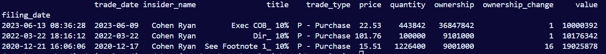
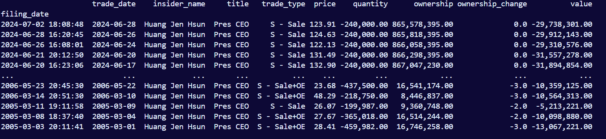

# Insider Analysis

### Overview

- Get an insider's trades for a specific company.
- Backtest their trades against the stock price.

---

### Setup

1. Clone git repository: `https://github.com/Primitive-Coding/InsiderAnalysis.git`

2. Within the folder `InsiderAnalysis` clone git repository: `https://github.com/Primitive-Coding/OpenInsiderScraper.git`

3. Install the projects requirements with `pip install -r requirements.txt`

4. Setup `config.json` file.

```
    {
        "chrome_driver_path": "D:\\PATH TO CHROMEDRIVER\\chromedriver.exe",
        "data_export_path": "D:\\PATH TO STORE DATA\\OpenInsiderScraper\\InsiderData"
    }

```

---

### Instructions

- Create a class instance.
- In this example we will examine Ryan Cohen's trades for GameStop (GME).
- The class requires a last name, and a ticker. You can also add a `first_name` argument if multiple insider's share the same last name.
- Data will be scraped if it does not exist locally. After scraping it will be saved locally. In this case the data will be saved in `InsiderData\Tickers\GME.csv`

```
    insider = InsiderAnalysis(last_name="Cohen", ticker="GME")

    # Printing class instances is supported.
    print(insider)

    # Output

    Full Name: Cohen Ryan
    Titles: ['Exec COB 10%', 'Dir 10%', 'See Footnote 1 10%']

    [Trades Overview]
    ----------------
    Purchases
    ----
    Number of Purchases: 3
    Value Bought($): 39,202,612
    Shares Bought: 1,770,242

    Sales
    ----
    Number of Sales: 0
    Value Sold($): 0
    Shares Sold: 0
```

###### Get Purchases

- Get the purchases from an insider.

```
    insider = InsiderAnalysis("Cohen", "GME")
    df = insider.get_purchases()
```



###### Get Sales

- Get the sales from an insider
- Since Ryan Cohen currently has no recorded sales, we will use Jensen Huang from Nvidia as an example.

```
    insider = InsiderAnalysis("Huang", "NVDA")
    df = insider.get_sales()
```



###### Backtest Purchases

- Backtest purchases and see how the stock price performed after the trade.
- The column `adj_price` accounts for stock splits. It also uses the closing price on the date of the trade (`trade_date`), which is why some prices may show a small variation.
- The columns `1, 5, 30, 90, 365, current` represent the performance of the stock.
  - For the filing date `2023-06-13`:
    - The price increased 13.32% 1 day after the filing.
    - The price increased 8.29% 5 days after the filing.
    - The price increased 3.44% 30 days after the filing.
    - The price decreased -24.96% 90 days after the filing.
    - The price increased 12.26% 365 days after the filing.
    - The price increased 5.73% from the date of the filing to the current date.

```
    insider = InsiderAnalysis("Cohen", "GME")
    df = insider.backtest_purchases(post_performance_ranges=[1,5,30,90,365])

    # Output

                        trade_date   price   adj_price 1       5    30        90    365  current
    filing_date
    2023-06-13 08:36:28  2023-06-09  22.53    22.68  13.32   8.29   3.44    -24.96  12.26     5.73
    2022-03-22 18:16:12  2022-03-22 101.76    30.78  14.50  23.40  14.96     9.75 -22.46   -22.10
    2020-12-21 16:06:06  2020-12-17  15.51     3.71  31.22  35.87  163.79  1,250.44 966.22   546.80
```

###### Backtest Sales

- Backtest sales and see how the stock price performed after the trade.
- If there are no recorded sales then an empty dataframe will be returned.

```
    insider = InsiderAnalysis("Cohen", "GME")
    df = insider.backtest_sales(post_performance_ranges=[1,5,30,90,365])

    # Output

    Empty DataFrame
    Columns: []
    Index: []
```
